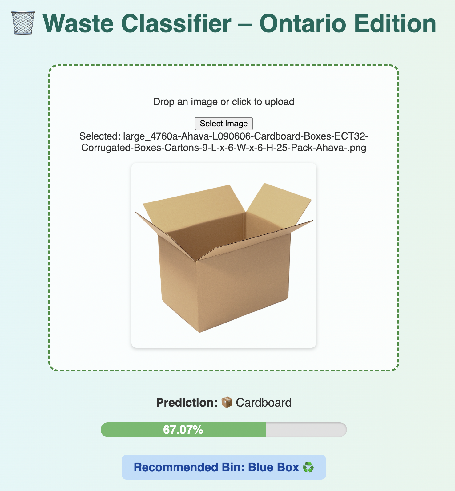
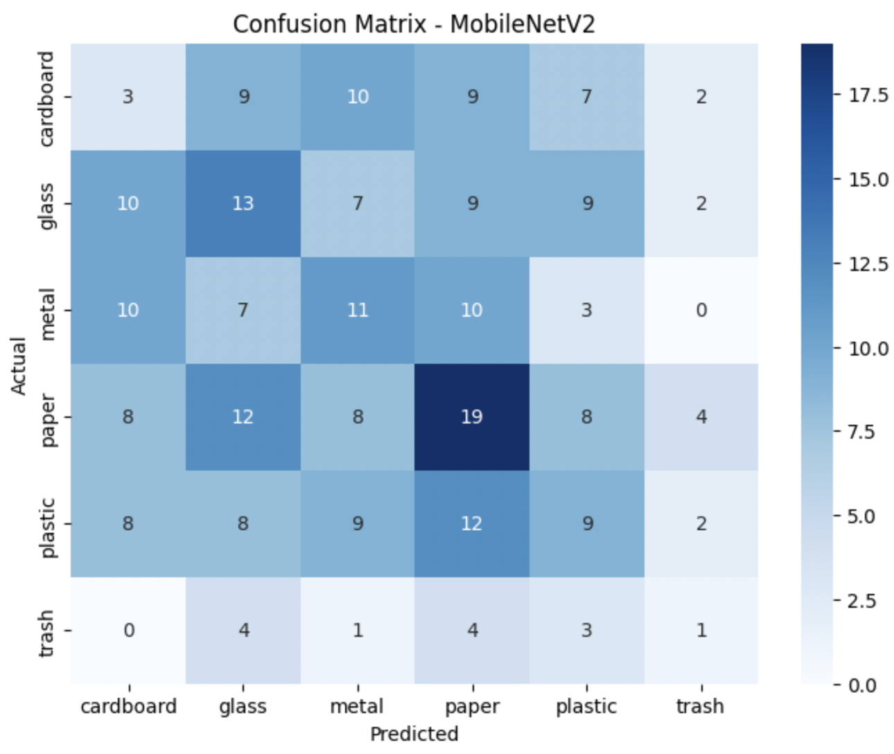

# 🧠 Waste Classifier with Smart Bin Recommendation ♻️

This is a **deep learning web app** that classifies an image of waste (plastic, glass, metal, cardboard, paper, or trash) and recommends the appropriate disposal bin based on **Ontario’s blue/black bin system**. Users can drag and drop an image, and the app will instantly return a prediction with emoji-labeled feedback, confidence level, and disposal instructions.


---

## 📸 Example Output



---

## 🧰 Tech Stack

| Technology        | Purpose                                    |
|------------------|---------------------------------------------|
| Python            | Core backend logic                         |
| Flask             | Web framework for handling routes and APIs |
| HTML/CSS/JS       | Frontend UI with drag-and-drop support     |
| TensorFlow/Keras  | Deep learning model (MobileNet-based)      |
| NumPy             | Image preprocessing                        |

---

## 📦 Waste Categories Recognized

- 📦 Cardboard → Blue Box ♻️  
- 🧪 Glass → Blue Box ♻️  
- 🥢 Metal → Blue Box ♻️  
- 📄 Paper → Blue Box ♻️  
- 🧴 Plastic → Blue Box ♻️  
- 🚮 Trash → Black Bin 🗑️  

---

## 📊 Model Accuracy

- **Model:** MobileNetV2 (transfer learning)
- **Input Size:** 224x224 pixels
- **Final Accuracy:** ~60% (significantly improved from baseline ~22%)
- **Performance Notes:**
  - Cardboard and Paper → consistently accurate
  - Glass ↔️ Plastic → occasional misclassifications
  - Trash → more distinct when image is clear

---

🧾 **Confusion Matrix**  
*(To be added)*  


---

## 🚀 How to Use

1. **Clone the Repository**  
   ```bash
   git clone https://github.com/your-username/waste-classifier.git
   cd waste-classifier

2. **Create a Virtual Environment (optional but recommended)**
   ```bash
    python -m venv venv
   source venv/bin/activate  # On Windows: venv\Scripts\activate
   
3. **Install Dependencies**
   ```bash
    pip install -r requirements.txt
4. **Run the App**
   ```bash
    python app.py
5. **Access the Web Interface**
Open your browser and go to:
http://localhost:5000

---

## 🌐 Future Plans
**Cloud Hosting:**
Planning to host the app on a cloud platform so recruiters and users can access it directly via a link without needing to set it up locally.

**Model Optimization:**
Reduce the model file size and improve misclassifications (e.g., plastic vs. glass).

**UI Enhancements:**
Improve mobile responsiveness and add accessibility features.

👤 Author
Manavi Manavi
3rd-Year Computer Science @ McMaster University
Aspiring Software Engineer


